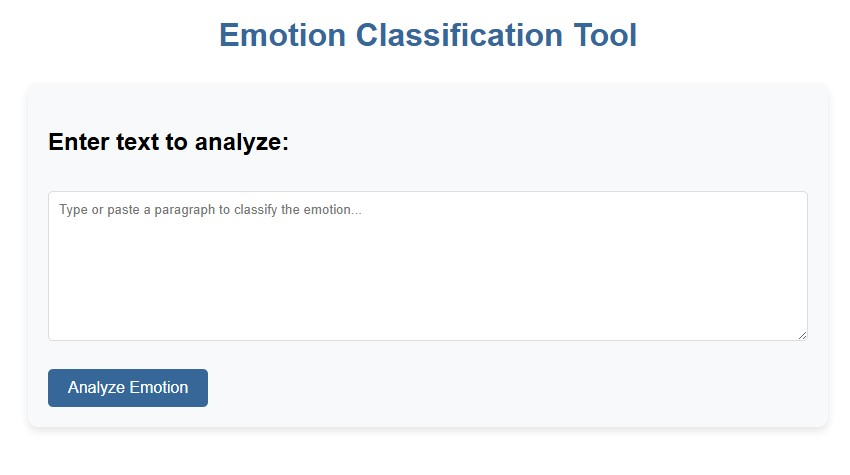
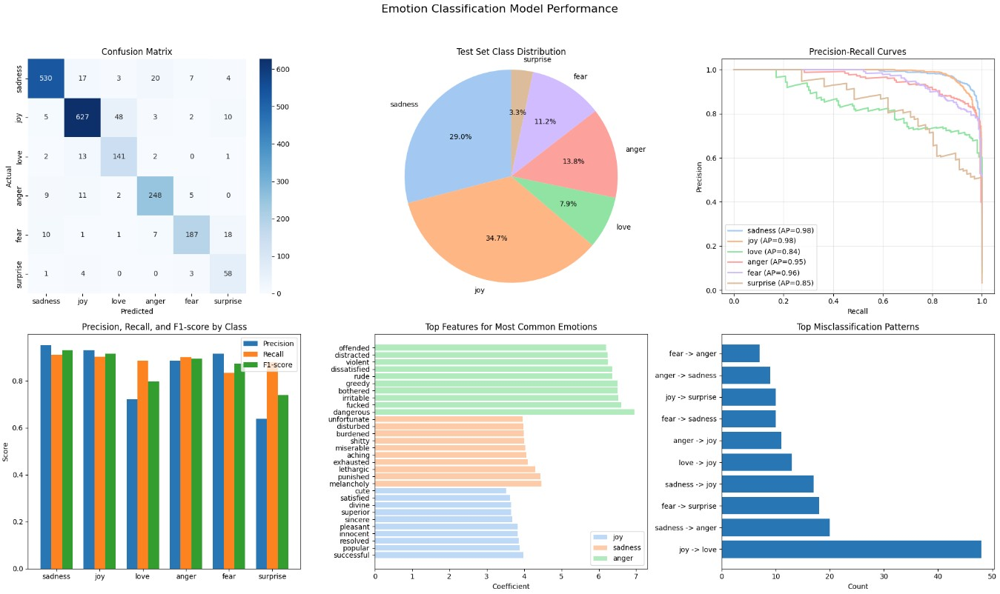
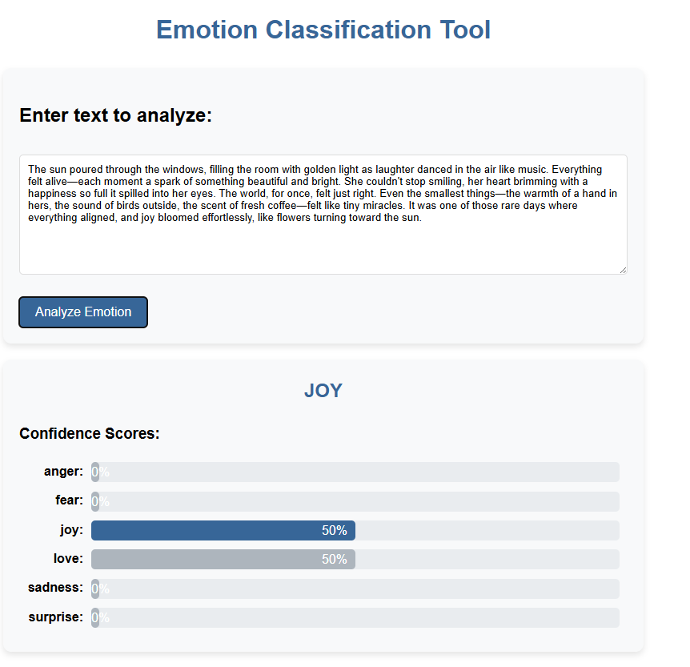
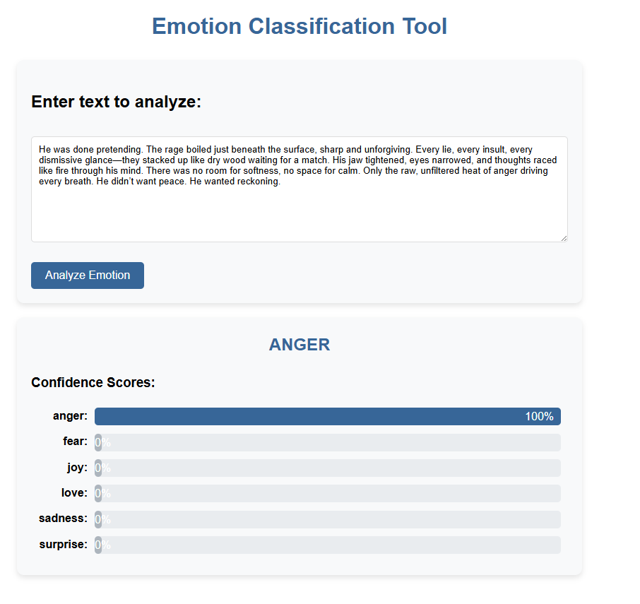

# Text-Based Emotion Classifier

A machine learning system that identifies six distinct emotions in text: Sadness, Joy, Love, Anger, Fear, and Surprise.



## Overview

This project implements an advanced emotion classification system that can analyze text input and determine the underlying emotional content. Using natural language processing techniques and machine learning, the system categorizes text into six fundamental emotions.

The emotion classifier can be used for:
- Analyzing customer feedback and support tickets
- Monitoring social media sentiment with emotional nuance
- Enhancing content creation by understanding emotional impact
- Supporting research on emotional expression in text
- Tracking emotional patterns in various contexts

## Features

- **Multi-class Emotion Detection**: Identifies six distinct emotions in text
- **Confidence Scores**: Provides probability scores for each emotion category
- **User-Friendly Interface**: Simple web interface for easy testing
- **Detailed Analysis**: Shows most influential words for the classification
- **Pre-processed Text**: Displays the cleaned input used for emotion analysis

## Model Performance

The system achieves high accuracy across various emotion categories:

| Metric | Score |
|--------|-------|
| Overall Accuracy | 89.55% |
| Macro F1-score | 0.86 |
| Weighted F1-score | 0.90 |

### Performance by Emotion Class

| Emotion | Precision | Recall | F1-Score |
|---------|-----------|--------|----------|
| Sadness | 0.95 | 0.91 | 0.93 |
| Joy | 0.93 | 0.90 | 0.92 |
| Love | 0.72 | 0.89 | 0.80 |
| Anger | 0.89 | 0.90 | 0.89 |
| Fear | 0.92 | 0.83 | 0.87 |
| Surprise | 0.64 | 0.88 | 0.74 |



## Feature Importance

Analysis of our model revealed the most important features for each emotion:

### Sadness
- melancholy (4.47)
- punished (4.43)
- lethargic (4.30)
- exhausted (4.10)
- miserable (4.04)

### Joy
- successful (3.98)
- popular (3.88)
- resolved (3.85)
- innocent (3.83)
- pleasant (3.82)

### Love
- caring (8.64)
- sympathetic (8.21)
- loving (8.13)
- supportive (8.00)
- longing (7.92)

### Anger
- dangerous (6.96)
- fucked (6.60)
- irritable (6.52)
- bothered (6.51)
- greedy (6.51)

### Fear
- shaken (7.65)
- terrified (7.50)
- reluctant (7.00)
- vulnerable (6.79)
- paranoid (6.61)

### Surprise
- impressed (12.44)
- amazed (11.92)
- surprised (11.44)
- curious (11.33)
- shocked (10.60)

## Example Analysis

### Joyful Text Example


### Angry Text Example


## Technical Implementation

### Architecture

The system consists of three main components:
1. **Text Preprocessing**: Cleans and normalizes input text
2. **Feature Engineering**: Transforms text into numerical features using TF-IDF with n-grams
3. **Classification Model**: Predicts emotion categories using Logistic Regression

### Technologies Used

- **Python**: Core programming language
- **Flask**: Web framework for the user interface
- **scikit-learn**: Machine learning library for model training
- **NLTK**: Natural language processing tools
- **HTML/CSS/JavaScript**: Frontend interface

## Installation

### Prerequisites
- Python 3.8 or higher
- pip package manager

### Setup

1. Clone the repository:
```
git clone https://github.com/thakshana02/emotion_tracker.git
cd emotion-tracker
```

2. Install required packages:
```
pip install -r requirements.txt
```

3. Run the application:
```
cd script
python app.py
```

4. Open your browser and navigate to:
```
http://127.0.0.1:5000/
```

## How to Use

1. Enter or paste text in the input field
2. Click "Analyze Emotion"
3. View the predicted emotion and confidence scores

## Project Structure

```
emotion-tracker/
├── data/                        # Dataset
│   ├── train.csv                # Training data
│   ├── val.csv                  # Validation data
│   └── test.csv                 # Test data
├── models/                      # Saved models
│   ├── emotion_classifier.pkl   # Trained model
│   └── tfidf_vectorizer.pkl     # TF-IDF vectorizer
├── script/                      # Application code
│   ├── app.py                   # Flask web application
│   └── requirements.txt         # Dependencies
├── notebooks/                   # Jupyter notebooks
│   └── emotion_classifier.ipynb # Model training notebook
└── screenshots/                 # Screenshots for documentation
    ├── app_screenshot.png       # Main UI screenshot
    ├── class_distribution.png   # Dataset distribution chart
    ├── joy_example.png          # Example of joy prediction
    └── anger_example.png        # Example of anger prediction
```

## Implementation Process

The project was developed in several stages:

1. **Data Collection**: Gathered text data with emotion labels through distant supervision
2. **Preprocessing**: Cleaned text data and removed noise
3. **Feature Engineering**: Created TF-IDF vectors with n-grams (1-3)
4. **Model Training**: Implemented logistic regression with class balancing
5. **Evaluation**: Tested on validation and test sets
6. **Web Application**: Developed Flask interface for easy usage

## Challenges and Solutions

### Feature Compatibility
- **Challenge**: TF-IDF vector from saved model had compatibility issues across versions.
- **Solution**: Created a new vectorizer that produces features compatible with the trained model.

### Class Imbalance
- **Challenge**: Uneven distribution of emotion classes in the dataset.
- **Solution**: Used class weights in the logistic regression model to balance the influence of each class.

## Applications

This emotion classification system can be used for various applications:

- **Social Media Analytics**: Track emotional responses to brands, products, or campaigns
- **Customer Experience**: Prioritize customer service based on emotional urgency
- **Content Creation**: Analyze which content evokes desired emotional responses
- **Mental Health Applications**: Help track emotional patterns in text over time
- **Education & Research**: Support studies on emotional expression in text

## Future Improvements

- Implement multi-label classification for text with mixed emotions
- Add emotion intensity measurement
- Expand the model to support more languages
- Improve preprocessing for social media specific text
- Create a more robust API for integration with other applications

## Acknowledgments

- The contributors who helped build the emotion dataset
- The open-source community for libraries and tools

## License

This project is licensed under the MIT License - see the LICENSE file for details.